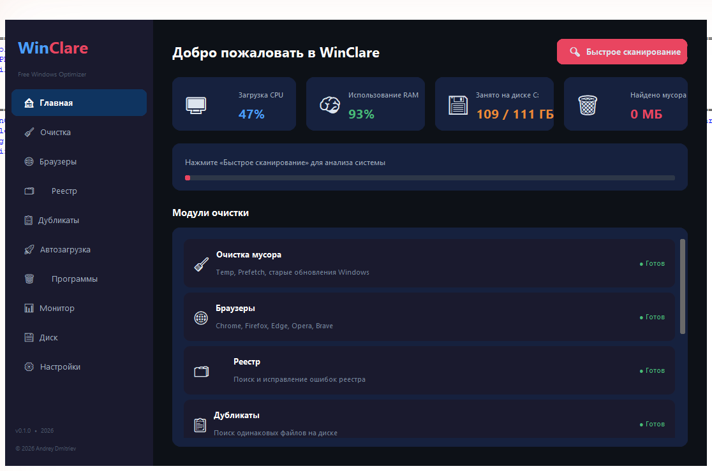

<div align="center">

# 🪟 WinClare — Free Windows Optimizer

**Бесплатный аналог CCleaner Pro — без рекламы, без ограничений**


</div>

---

## ✨ Возможности

| Модуль | Описание |
|--------|----------|
| 🧹 **Очистка мусора** | Temp, Prefetch, кэш обновлений, корзина, лог-файлы |
| 🌐 **Очистка браузеров** | Chrome, Edge, Opera, Firefox, Яндекс, Brave, Vivaldi |
| 🗂️ **Очистка реестра** | Поиск битых ключей + резервная копия перед исправлением |
| 📋 **Поиск дубликатов** | MD5-хэш, выбор диска, авто-выбор новейшего/старейшего |
| 🚀 **Автозагрузка** | Управление автозапуском: реестр, папки, планировщик |
| 🗑️ **Деинсталлятор** | Удаление программ с поиском и сортировкой по размеру |
| 📊 **Монитор системы** | CPU, RAM, диски, сеть, процессы в реальном времени |
| 💾 **Анализ диска** | Топ папок и файлов по размеру, карточки дисков |
| ⚙️ **Настройки** | Автозапуск, расписание очистки, логирование |

---

## 📥 Скачать

> **[⬇ WinClare v1.0.0 — Скачать .exe](../../releases/latest)**

Просто скачай `.exe` — установка не требуется. Portable-версия.

---

## 🖥️ Скриншоты



---

## 💻 Системные требования

- Windows 10 / 11 (64-bit)
- Оперативная память: 100 МБ
- Дисковое пространство: 50 МБ

---

## 🔧 Запуск из исходников

```bash
# 1. Клонировать репозиторий
git clone https://github.com/YOUR_USERNAME/WinClare.git
cd WinClare

# 2. Установить зависимости
pip install -r requirements.txt

# 3. Запустить
python main.py
```

**Зависимости:**
```
customtkinter>=5.2.0
psutil>=5.9.0
pywin32>=306
send2trash>=1.8.0
```

---

## 🗺️ Дорожная карта

### ✅ v1.0.0 — Free (текущая версия)
- [x] 8 модулей очистки и оптимизации
- [x] Русский интерфейс
- [x] Тёмная тема

### 🔜 v2.0.0 — Pro (в разработке)
- [ ] Светлая тема
- [ ] Планировщик автоматической очистки
- [ ] Экспорт отчётов в PDF
- [ ] Оптимизация производительности
- [ ] Приоритетная поддержка

---

## 📄 Лицензия

Copyright © 2026 Andrey Dmitriev. Все права защищены.  
Смотрите файл [LICENSE.txt](LICENSE.txt) для подробностей.

---

## 📬 Контакт

По вопросам: Andrew24Pr@proton.me
